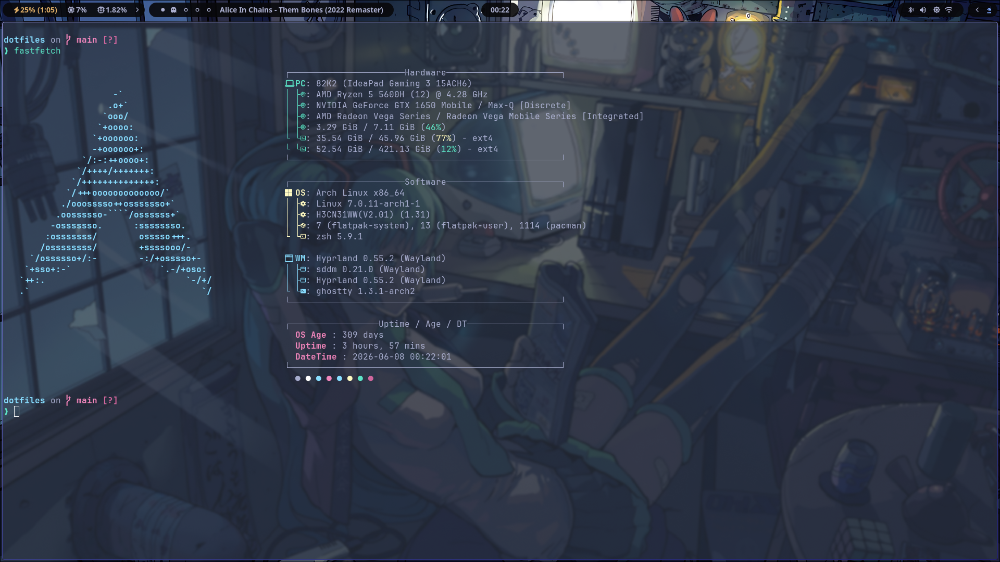
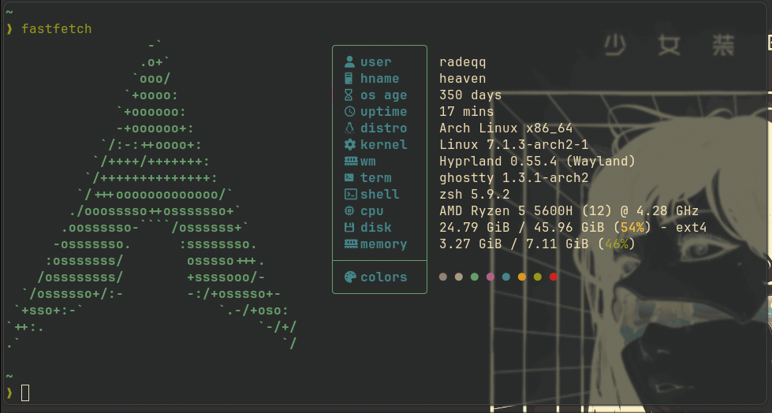
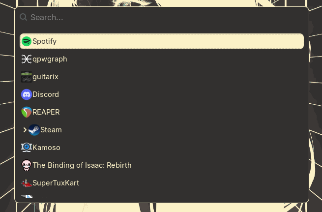

# Arch + Hyprland config

## Config includes

### Hyprland

Main config is located in `.config/hypr/hyprland.lua` which imports the respective files:

- `.config/hypr/modules/autostart.lua` - contains applications that start on startup (waybar, hyprpaper, poweralertd etc.)
- `.config/hypr/modules/appearance.lua` - contains animations, appearance and visual settings
- `.config/hypr/modules/input.lua` - contains the keyboard layout and touchpad scroll behavior / gestures config
- `.config/hypr/modules/keybinds.lua` - contains the keybindings listed below
  - `SUPER` as the main mod key
  - `mainMod + L` - hyprlock
  - `mainMod + Q` - terminal (ghostty)
  - `mainMod + B` - browser (Zen)
  - `mainMod + F` - file manager (thunar)
  - `mainMod + Space` - menu (wofi)
  - `mainMod + V` - toggle windows floating
  - `mainMod + M` - stop the current uwsm session
  - `mainMod + .` - wofi emoji
  - `mainMod + P` - enable pseudotiling
  - `mainMod + /` - toggle split
  - `mainMod + left / h` - move focus to left
  - `mainMod + right / l` - move focus to right
  - `mainMod + up / k` - move focus up
  - `mainMod + down / j` - move focus down
  - `mainMod + <1-10>` - switch workspaces
  - `mainMod + <numpad keys respective to the numbers>` - switch workspaces
- `.config/hypr/modules/monitors.lua` - monitors config
- `.config/hypr/modules/windows.lua` - windows behavior

### Hyprpaper

Uses the `.config/pictures/wallpaper.png` file.

### Hypridle

`.config/hypr/hypridle.conf`

### Hyprlock

Uses `.config/pictures/pfp.jpg` for the profile picture.
Also, uses the same wallpaper (`.config/pictures/wallpaper.png`) as hyprpaper.

### zsh

- zinit
- starship
- autocompletion
- fuzzy find tab completion
- zoxide

### Fastfetch

### Waybar

### wlogout

Uses the [Catppuccin Theme](https://github.com/catppuccin/wlogout)

### wofi

### Neovim

Linked as a submodule. The full NeoVim config and its details are located in [this repo](https://github.com/radeqq007/nvim-config).
